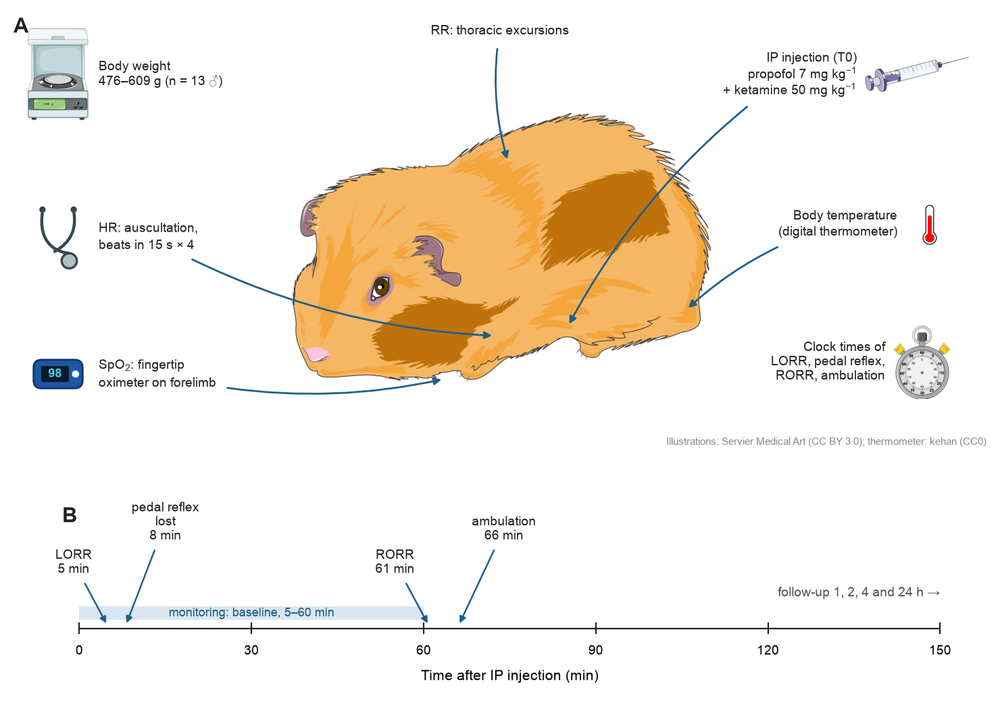
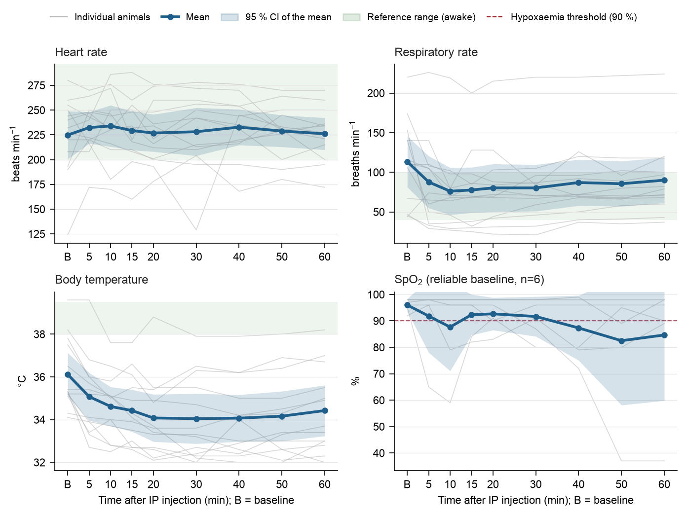
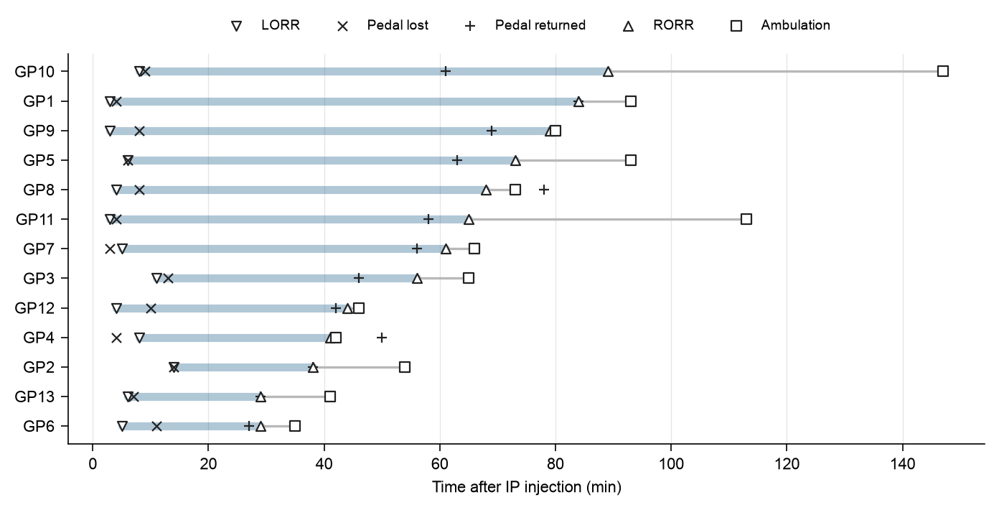

# Intraperitoneal Propofol–Ketamine Anaesthesia in Native Andean Guinea Pigs

**A single intraperitoneal injection, no venous access, no α₂-agonist: what happens to induction,
heart rate, breathing, body temperature and recovery? A pilot study of 13 native Andean guinea pigs
at 3800 m, with every handwritten record digitised twice and every reported value reproducible from
this repository.**

[](#citation)
[](LICENSE)
[](data/LICENSE)
[](https://www.python.org/)
[](https://arriveguidelines.org)
[](#from-handwritten-records-to-a-verified-dataset)
[](#reproducing-the-results)

**Yoshely Viky Carbajal Mamani** — Facultad de Medicina Veterinaria y Zootecnia, Universidad Nacional del
Altiplano, Puno, Peru.

This repository holds the data and the code; the article itself will be distributed by the journal.

---

## Overview

Guinea pigs are anaesthetised as laboratory animals, as companion animals and — in the Andes — as a
farmed food animal, often where inhalant anaesthesia is not available. The standard injectable
option, ketamine–xylazine, has been advised against after a telemetry study showed an unreliable
plane, prolonged bradycardia and profound hypothermia. Propofol avoids α₂-agonists but has been
described in this species only as an intravenous infusion, and venous access is exactly what is hard
to obtain in a guinea pig.

This pilot study asks a practical question: *what does a single intraperitoneal (IP) injection of
propofol (7 mg kg⁻¹) plus ketamine (50 mg kg⁻¹) actually do in native Andean (criollo) guinea pigs
at high altitude?*



*(A) What was measured and how: heart rate by auscultation, respiratory rate from thoracic
excursions, SpO₂ with a fingertip oximeter on the forelimb, body temperature, and the clock times of
reflex loss and return. (B) Median times of the main events after the injection.*

---

## Key results

13 male guinea pigs, 476–609 g; doses recomputed from the injected volumes: propofol
6.98 ± 0.06 mg kg⁻¹, ketamine 49.7 ± 0.8 mg kg⁻¹.

| Outcome | Median (IQR) or n/N | 95 % CI |
|---|:---:|:---:|
| Loss of righting reflex (LORR) | 5 (4–8) min | 3–8 |
| Loss of pedal withdrawal reflex | 8 (4–10) min | 4–11 |
| Return of righting reflex (RORR) | 61 (41–73) min | 38–79 |
| Duration of LORR | 56 (33–67) min | 24–76 |
| Ambulation | 66 (46–93) min | 42–93 |
| Pedal reflex absent in all animals | only at 15–20 min | — |
| Hypothermia (≥ 1 °C drop) | 12/13 | 64–100 % |
| Bradypnoea (≥ 50 % RR drop) | 4/13 | 9–61 % |



*Grey: individual animals. Blue: mean and 95 % CI. Green band: awake reference range.*

- **Induction was reliable.** All 13 animals lost the righting reflex, at a median of 5 min.
- **Heart rate did not change** over 60 min (mixed model P = 0.94; Friedman P = 0.96), unlike
  α₂-agonist protocols.
- **Breathing slowed by about one third** (nadir −37 breaths min⁻¹ at 10 min, P < 0.001) and stayed
  depressed for the whole hour.
- **Body temperature fell by a median of 2.8 °C** and had not recovered at 60 min — the main safety
  concern, and a reason to provide active warming.
- **Deep anaesthesia was brief.** Immobilisation lasted about an hour, but the pedal reflex was
  absent in every animal only between 15 and 20 min.
- **The fingertip oximeter was unreliable**: 7 of 13 awake animals read below 90 %.

**What this study cannot tell you.** It is a single-arm pilot. The IP propofol dose is 7–30 times
lower than the IP doses studied in mice, and IP drugs undergo hepatic first-pass extraction, so part —
possibly most — of the effect may be due to ketamine alone. A controlled comparison with ketamine alone
is the next step.



---

## From handwritten records to a verified dataset

The data were collected on 13 handwritten anaesthetic records (104 scanned pages) filled in by
different teams of veterinary students under supervision. Before any analysis:

| Step | Result |
|---|---|
| Two independent, blinded transcriptions (P1, P2) into a fixed JSON schema | 1742 fields compared |
| Field-level agreement P1 vs P2 | 98.5 %; 3 value discrepancies, resolved against the enlarged scan |
| Third, independent transcription of the vital signs | 468 values, 97.4 % agreement; 12 discrepancies adjudicated |
| Every correction (units, am/pm, swapped fields, a 10× volume typo) | written to a decision log with its justification |

The original transcriptions are never overwritten: corrections live in code (`src/clean.py`) and in
[`docs/decisiones.md`](docs/decisiones.md). Adverse events are defined from the recorded physiology with
thresholds relative to each animal's baseline, because the checklist boxes on the forms often
contradicted the recorded values.

---

## Repository structure

```
data/
  transcription/pass1/  pass2/   verified JSON transcriptions (student names redacted)
  transcription/SCHEMA.md         transcription schema and rules
  transcription/resoluciones.csv  adjudicated discrepancies
  processed/                      analytical dataset: animals.csv, monitoring.csv
docs/decisiones.md                data-management decision log (Spanish)
src/
  run_all.py        runs the whole pipeline
  build_dataset.py  JSON -> raw tables          compare_passes.py  double-entry agreement
  clean.py          analytical dataset          analysis.py        mixed models, Friedman, CIs, figures
  figures_extra.py  design and supplementary figures              make_tables.py  LaTeX tables
  config.py         concentrations, sessions and adverse-event thresholds
analysis/
  tables/           every reported number (CSV)
  figures/          figures in English; figures/es/ the same figures in Spanish
  assets/           illustrations and their licences
```

---

## Reproducing the results

```bash
git clone https://github.com/Andre031222/propofol-ketamine-guinea-pig.git
cd propofol-ketamine-guinea-pig
python3 -m venv .venv && source .venv/bin/activate
pip install -r requirements.txt
python src/run_all.py
```

The pipeline regenerates `data/processed/`, every table in `analysis/tables/` and every figure in
`analysis/figures/` from the verified transcriptions. The figure of the experimental
set-up needs the Cairo library for SVG rendering (`brew install cairo` on macOS,
`apt install libcairo2` on Debian/Ubuntu). Figures use Arial when available and fall back to
DejaVu Sans otherwise.

### Statistical methods

| Question | Method |
|---|---|
| Change of HR, RR, temperature, SpO₂ over time | Linear mixed-effects model (time and session fixed, random intercept per animal, REML); joint Wald test; contrasts vs baseline with Holm adjustment |
| Sensitivity | Friedman test with Kendall's W |
| Event times | Median, IQR and distribution-free 95 % CI from binomial order statistics |
| Adverse-event proportions | Exact Clopper–Pearson 95 % CI |
| Exploratory associations | Spearman's ρ (unadjusted) |

---

## Data availability and privacy

The scanned records are not published because they contain the names and signatures of the
students who filled them in. The transcriptions published here are complete except for those names,
which are replaced by `Team XX member A/B`.

## Citation

Manuscript in preparation. Until it is published, please cite this repository:

```bibtex
@misc{carbajal2026propofolketamine,
  author = {Carbajal Mamani, Yoshely Viky},
  title  = {Intraperitoneal propofol--ketamine in Andean guinea pigs: reliable immobilisation but marked hypothermia (data and code)},
  year   = {2026},
  url    = {https://github.com/Andre031222/propofol-ketamine-guinea-pig}
}
```

## Licence

Code: [MIT](LICENSE). Data and figures: [CC BY 4.0](data/LICENSE). Illustrations: Servier Medical Art
(CC BY 3.0), PhyloPic and kehan (CC0) — see [`analysis/assets/LICENSES.md`](analysis/assets/LICENSES.md).
